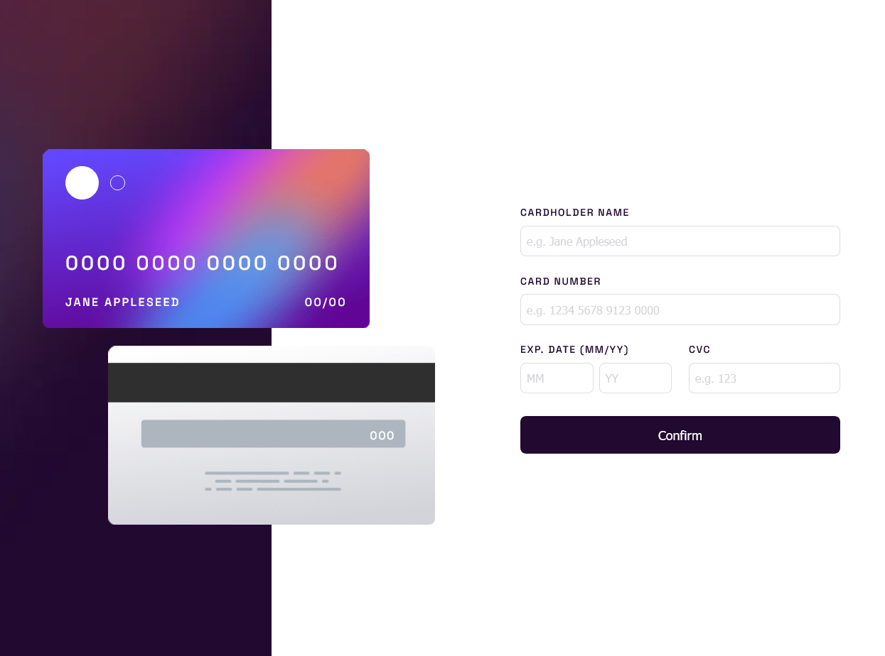

# Frontend Mentor - Interactive card details form solution

This is a solution to the [Interactive card details form challenge on Frontend Mentor](https://www.frontendmentor.io/challenges/interactive-card-details-form-XpS8cKZDWw). Frontend Mentor challenges help you improve your coding skills by building realistic projects.

## Table of contents

- [Links](#links)
- [The challenge](#the-challenge)
- [Technologies](#technologies)
- [Screenshot](#screenshot)
- [What I learned](#what-i-learned)
- [Improvements](#improvements)
- [Author](#author)
- [Acknowledgments](#acknowledgments)

## Links

- [Solution URL](https://github.com/capelaum/card-form)
- [Live Site URL](https://card-form-capelaum.vercel.app)

## The challenge

Users should be able to:

- [x] Fill in the form and see the card details update in real-time
- [x] Receive error messages when the form is submitted if:
  - [x] Any input field is empty
  - [x] The card number, expiry date, or CVC fields are in the wrong format
- [x] View the optimal layout depending on their device's screen size
- [x] See hover, active, and focus states for interactive elements on the page

## Technologies

- [React.js](https://reactjs.org) - UI JS library
- [Next.js](https://nextjs.org) - React framework
- [Typescript](https://www.typescriptlang.org)
- [Stitches](https://stitches.dev) - CSS in JS Styles
- [Radix UI](https://www.radix-ui.com) - Primitive UI components
- [React Hook Form](https://react-hook-form.com) - Form management
- [Zod](https://zod.dev) - Form validations

## Screenshot



## What I learned

Learned how to format and valdiate some card fields, like card number, expiration month and year, and CVC.

```typescript
const formatCardNumber = (value: string) => {
  return (
    value
      .replace(/\s/g, '')
      // regular expression to match groups of four digits in the input string,
      // and replaces each group with itself ($1) followed by a space
      .replace(/(\d{4})/g, '$1 ')
      // regular expression to match any characters that are not digits or whitespace
      // and removes them from the input string
      .replace(/[^\d\s]/g, '')
      .trim()
      // substring to ensure that the input string is no longer than 19 characters
      .substring(0, 19)
  )
}
```

Learned more about styling with stitches, using absolute positions, media queries and setting background images with static image data.

```typescript
export const CardFrontWrapper = styled(CardBaseWrapper, {
  top: '50%',
  left: '30%',
  transform: 'translate(-70%, -100%)',
  zIndex: 1,

  backgroundImage: `url(${CardFront.src})`,

  '@media(max-width: 1200px)': {
    transform: 'translate(-65%, -80%) scale(0.6)',
  },

  '@media(max-width: 768px)': {
    left: '50%',
    top: 0,

    transform: 'translate(-56%, 27%) scale(0.6)',
  },

  '@media(max-width: 360px)': {
    transform: 'translate(-54%, 22%) scale(0.6)',
  },
})
```

## Improvements

The hardest part of the challenge envolved styling, as I had to resort to absolute positioning and some transform properties, so the implementation of the responsive design could be improved in my opinion.

## Author

- Website - [My Portfolio](https://www.luiscapelletto.com)
- Frontend Mentor - [@capelaum](https://www.frontendmentor.io/profile/capelaum)

## Acknowledgments

Thank to [Agência metodo](https://agenciametodo.com) for the challenge 👌.
